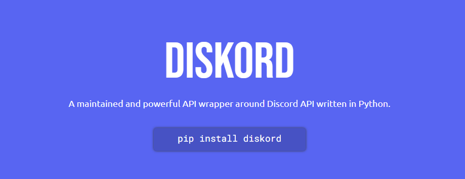

<div align="center">
    
    <h1>Diskord</h1>
    
    
    
    
    <hr>
    <p>
        A modern, easy to use, feature-rich, and async ready API wrapper for Discord written in Python.
        <br><br>
        This library is a maintained and work-in-progress fork of the popular library, <a href="https://github.com/Rapptz/discord.py">discord.py</a>.
    </p>
</div>

## Key features
* Modern Pythonic API using `async` and `await`.
* Proper rate limit handling.
* Optimised in both speed and memory.
* Actively maintained
* Provides 100% coverage of Discord API.
* User-friendly OOP-based API.

## Installation

**Python 3.8 or higher** is required to use this library.

### Basic Installation
To install the library **without** full voice support, you can just run the following command:
```sh
python -m pip install diskord
```

### Voice Support
Optionally, To interact with discord's voice API, You would require voice support of this library which you can install like so:
```sh
python -m pip install diskord[voice]
```

### Development Version
**Please beware that development version is not guaranteed to be stable. There can be breaking changes and potentially critical bugs. Use with cautions.**

You must have git installed to install development version. Otherwise, you can download the code.
```sh
$ git clone https://github.com/nerdguyahmad/diskord
$ cd diskord
$ python3 -m pip install -U .[voice]
```

### Optional Packages
* PyNaCl (for voice support, This is usually handled by pip when [installing voice support](#voice-support))

### Linux Installation

Please note that on Linux installing voice you must install the following packages via your favourite package manager (e.g. `apt`, `dnf`, etc) before running the above commands:

* libffi-dev (or `libffi-devel` on some systems)
* python-dev (e.g. `python3.6-dev` for Python 3.6)

## Quick Example
Here are some quick examples to give you a quickstart and show off the basic features of the library.

### Application (Slash) Commands
```py
import diskord

bot = diskord.Bot()

@bot.slash_command('ping', description='Ping-Pong!')
async def ping(ctx):
    await ctx.send('Pong!')

bot.run('token')
```

## Legacy Commands
```py
import diskord
from diskord.ext import commands

bot = commands.Bot(command_prefix='>')

@bot.command()
async def ping(ctx):
    await ctx.send('pong')

bot.run('token')
```
You can find more examples in the examples directory.

## Links
* [Documentation](https://diskord.readthedocs.io/en/latest/index.html)
* [Official Discord Server](https://dsc.gg/diskord-dev)
* [Discord API](https://discord.gg/discord-api)
* [Developer Portal](https://developer.discord.com/applications)
